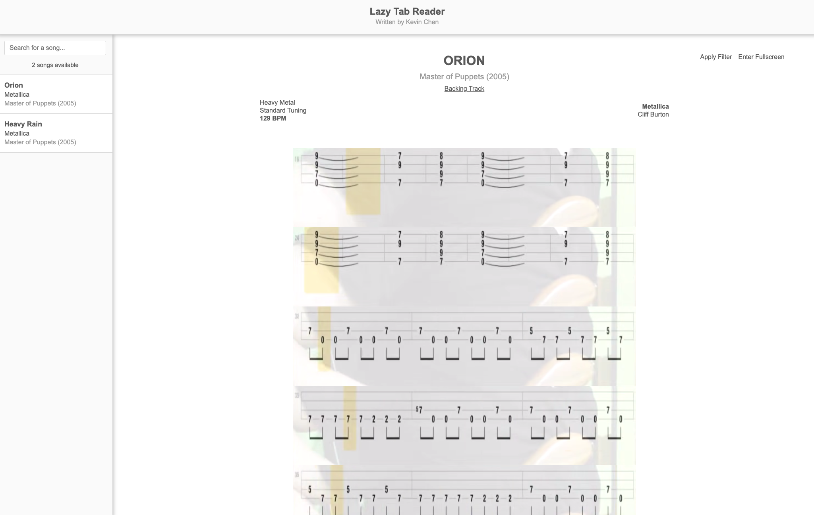

# Lazy Tab Reader

## Introduction

Cheap and easy way to transcribe without whipping out MuseScore or any other muscial notation software. Simply screenshot
a bunch of frames once, add a little helping config, and you're ready to JAM!

## How to add new song

To add a new song to be supported by the LazyTabReader, do the following:

1. Create new folder with the pattern: `${Song name} - ${Artist} (${Date})` (call this `X` for ths purpose of this guide)
2. Create subfolder `frames`
    1. Take screenshots and save to `frames`
    2. Once all frames are created, rename accordingly, in order (zero-indexed, with zero prefix buffer)
4. Add new song to song bank
    2. Open `Songs/Bank.js` and add new entry using the provided template as a starting point
    3. Make appropriate song data adjustments to `config.js`
5. Open `LazyTabReader.html`
    1. From UI, click the song that you wish to play
6. Ready to JAM

## Trick for easier screenshotting sessions

1. Use `Cmd + Shift + 5`
2. Drag captured selection to appropriate area
3. Start playing your YouTube video that has tabs included
4. Click `Capture` when ready!
5. Repeat until song is done and all frames are captured!
6. Once all frames are screenshotted, all frames need to be indexed accordingly, can consider using the `__dev__/node_scripts/assignFrameIndex.js`, but that is definitely WIP

## Code Overview

- all main code driving this "app" is located under `__dev__`
- for a good investigation starting point, start with `LazyTabReader.html` and follow the code paths accordingly
- helper scripts are located under `__dev__/scripts`
