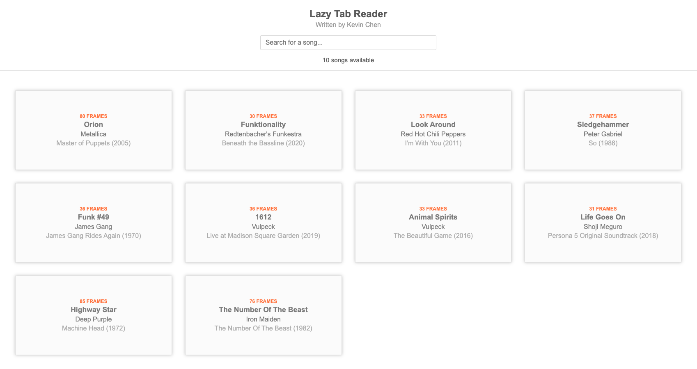

# Lazy Tab Reader

Too lazy to transcribe, but not too lazy to write an app to read other people's amazing tabs; one frame at a time...

## Introduction

Cheap and easy way to transcribe without whipping out MuseScore or any other muscial notation software. Simply screenshot
a bunch of frames once, add a little helping config, and you're ready to JAM!



## Getting Started

Static webpage! That's right, no fancy front-end development framework, also too lazy to make a GitHub Page.

Simply, download the project as a ZIP, open `LazyTabReader.html` in the downloaded directory, new tab will open. You're welcome :) 

## How to add new song

To add a new song to be supported by the LazyTabReader, do the following:

1. Create new folder with the pattern: `${Song name} - ${Artist} (${Year})` (call this `X` for ths purpose of this guide)
2. Create subfolder `frames`
    1. Take screenshots and save to `frames`
    2. Once all frames are created, rename accordingly, in order (1-indexed, with zero prefix buffer)
4. Add new song to song bank
    2. Open `Songs/Bank.js` and add new entry using the provided template as a starting point
    3. Make appropriate song data adjustments
5. Open `LazyTabReader.html`
    1. From UI, click the song that you wish to play
6. Ready to JAM

### Here's what a template config looks like

```
{
  // this is the singly most important field to populate correctly
  id: "{SONG_TITLE} - {ARTIST} ({RELEASE_YEAR})",

  // misc metadata
  title: 'SONG_TITLE',
  subtitle: 'ALBUM_NAME (RELEASE_YEAR)',
  artist: 'ARTIST_NAME',
  instrumentalist: 'INSTRUMENTALIST_NAME',
  backingTrack: 'LINK_TO_BACKING_TRACK',
  style: 'STYLE',
  tuning: 'Standard Tuning',
  tempo: '100 BPM',

  // frame data
  totalRegisteredFrames: 100,

  // this will be the most annoying part, to get these values,
  // first just insert the natural dimensions of each screenshot (average)
  //
  // then adjust accordingly
  //
  frameWidth: 1000,
  frameHeight: 200
}
```

## Trick for easier screenshotting sessions

1. Use `Cmd + Shift + 5`
2. Drag captured selection to appropriate area
3. Start playing your YouTube video that has tabs included
4. Click `Capture` when ready!
5. Repeat until song is done and all frames are captured!
6. Once all frames are screenshotted, all frames need to be indexed accordingly, can consider using the `__dev__/node_scripts/assignFrameIndex.js`, but that is definitely WIP

NOTE: final file names should have these characteristics:
- 1-indexed
- No gaps
- prefix with zero buffers to match maximium number of digits (e.g. 81 frames = 2 digits, so 1.png should be 01.png, 230 frames = 3 digits, so 1.png should be 001.png etc)

## Code Overview

- all main code driving this "app" is located under `__dev__`
- for a good investigation starting point, start with `LazyTabReader.html` and follow the code paths accordingly
- helper scripts are located under `__dev__/scripts`

License
-------------
Copyright (c) 2021 Kevin Chen.

